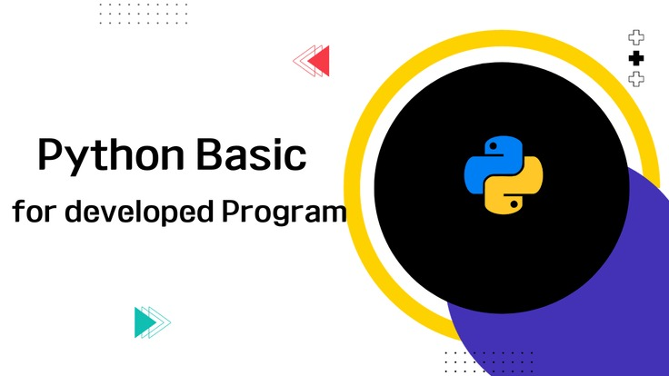
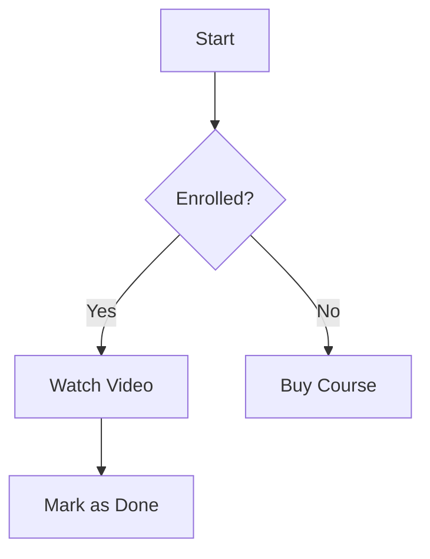

# Welcome to Python 101

이 수업은 **로컬 동기화**를 통해 업로드되었습니다.




## 수식 테스트 (KaTeX)

인라인 수식: $E = mc^2$ 그리고,

블록 수식 1:
$$\int_{a}^{b} x^2 dx = \left[ \frac{1}{3}x^3 \right]_{a}^{b}$$ 안녕하세요

블록 수식 2:
$$
\int_{a}^{b} x^2 dx = \left[ \frac{1}{3}x^3 \right]_{a}^{b}
$$


## 코드 테스트

```python
def hello_tetris():
    print("Keep building your knowledge like Tetris!")

hello_tetris()
```

## 다이어그램 테스트 (Mermaid)


